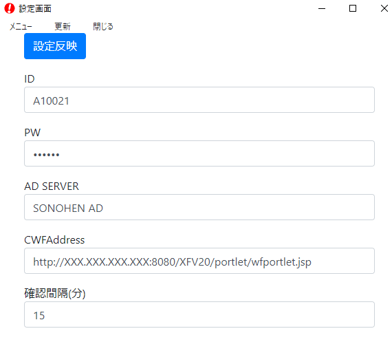

# cwfchecker について

## 概要

インフォテック社のワークフローシステムである[Create!web フロー](https://www.createwebflow.jp/)の処理まち案件がないかチェックするデスクトップアプリケーションです。

## 動作要件

- ポートレット表示オプションが使用可能であること。
- パスワードに「￥」、「"」を使用していないこと。
- 動作確認は バッケージ版 Create!web フロー v5.4.2 、windows10 端末のみです。その他の OS、クラウド版は試験していません。

## 機能

- 指定した間隔で、処理待ち案件がないかチェックし、案件がある場合はポップアップ（又はバーで通知）します。
- タスクトレイに常駐します。
- 案件確認・決裁までアプリ内で完結します。
- パスワードは safeStorage により暗号化して保存します。

## 依存ライブラリ・使用環境等

- electron ^37.2.2
- electron-store ^10.1.0
- keytar ^7.9.0(移行用途のみ)

- Node.js 22.16.0

## ライセンス・注意事項等

- 複製、変更、フォーク等も完全に自由ですが、無保証です。
- 橿原市は、本プログラムを利用したことによる一切の損害に関知しません。
- 本プログラムは、インフォテック社の公認・許諾等を受けていません。

## 起動・ビルド方法

- 方法１（ビルド済みバイナリの使用）

1.  リリースのバイナリをダウンロードして解凍、使用

- 方法２（ソースからのビルド）

1. node.js をインストールします。
1. mkdir hogehoge
1. hogehoge にソースコードをコピーします
1. cd hogehoge
1. npm install
1. npx electron .
1. パッケージ化・組織内で配布する場合は、electron-builder 等を使用します。npm run build で実行できます。

## 動作イメージ

## 使用方法

1.  ポートレット表示オプションがブラウザから表示できることを確認します。
1.  ビルドしたアプリケーションを起動し、メニュー＞設定画面を開きます。
1.  以下のような感じで設定します。
    
1.  設定反映ボタンを押します。
1.  ポートレットオプション画面が正常に表示されることを確認します。
1.  F3 キーで表示・非表示を切り替えます。
1.  タスクトレイ右クリック＞終了　又は　メニュー＞終了　で終了します。
