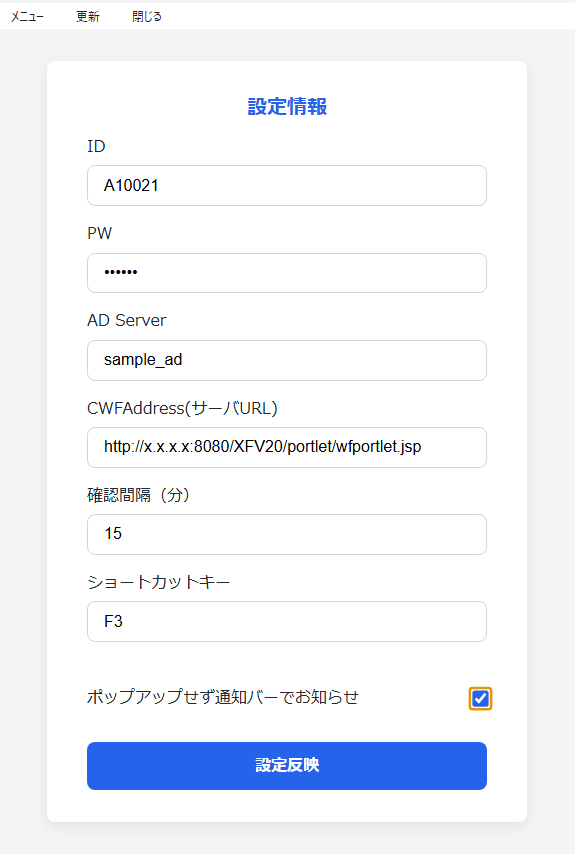

# cwfchecker について

## 概要

インフォテック社のワークフローシステムである[Create!web フロー](https://www.createwebflow.jp/)の処理まち案件がないかチェックするデスクトップアプリケーションです。

## 動作要件

- ポートレット表示オプションが使用可能であること。
- パスワードに「￥」、「"」を使用していないこと。
- 動作確認は バッケージ版 Create!web フロー 5.2.0 、windows10 端末 のみです。その他の OS、クラウド版は試験していません。

## 機能

- 指定した間隔で、処理待ち案件がないかチェックし、案件がある場合はポップアップします。
- タスクトレイに常駐します。
- 案件確認・決裁までアプリ内で完結します。

## 依存ライブラリ

- electron
- electron-store
- keytar

## ライセンス・注意事項等

- 複製、変更、フォーク等も完全に自由ですが、無保証です。
- 橿原市は、本プログラムを利用したことによる一切の損害に関知しません。
- 本プログラムは、インフォテック社の公認・許諾等を受けていません。
- electron v12 で PDF プレビューが開かないんですが、誰か解決法を教えて下さい。(T_T)

## 動作・ビルド方法

1. node.js をインストールします。
1. mkdir hogehoge
1. hogehoge にソースコードをコピーします
1. cd hogehoge
1. npm install
1. npx electron .
1. パッケージ化・組織内で配布する場合は、electron-builder 等を使用します。

## 動作イメージ

    

## 使用方法

1.  ポートレット表示オプションがブラウザから表示できることを確認します。
1.  ビルドしたアプリケーションを起動し、メニュー＞設定画面を開きます。
1.  以下のような感じで設定します。
    
1.  設定反映ボタンを押します。
1.  ポートレットオプション画面が正常に表示されることを確認します。
